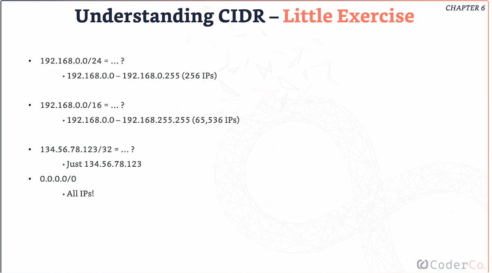

# AWS notes

## IAM

- Account that has access full access 

## Groups & Users
- Create individual users so each user has access to what they need
- Users can be grouped e.g. based on roles
-

## Permissions

- Users/groups are assigned policies, which are JSON documents - which define the level off access they have
- Always apply the least privellage principle - don't give more permission than needed 

## IAM Policies Inheritence

- Inline policies are specific to users and not the group
- If a user is part of a group and needs more access that other members of the group, you can set inline policies

## IAM Policies Structure

## IAM - Password Policy

- In AWS, you can setup password policy:
- Set minimum password length
- Require specific characters
- Allow all IAM users to change their paaswords
- Prevent reusign passwords

## MFA

- Most effective way to secure account
- Even if someone manages to get your password, they will need another security method e.g. Google authenticator, Hardware Key Fob, etc.

## AWS CLI - Command Line Interface

- Allows you to interact with AWS services from the terminal 
- Can do what you do in the console
- Allows you to manage scripts - automating tasks

## SDK - Software Development Kit

- Makes it easy to connect code to AWS services

## IAM Security Tools

**IAM Credentials Report**
- Report that lists all account's users and status of their various credentials 
- IAM Access Advisor (user-level)

**IAM Access Advisor (user level)**
- Shows service permissions granted to a users and when those were last accessed 
- Can be used to tune user permissions 

## Amazon EC2

- **EC2 - Elastic Compute Cloud - Infastructure as a Service**

- Renting virtual machines
- Store data on virtual drives (EBS)
- Distribute load across machines (ELB)
- Scaling services using auto scaling group (ASG) 

## EC2 sizing & configuration options

- OS: Linuxm Windows or Mac OS
How much:
    - CPU
    - RAM
    - Storage - Network attached (EBS & EFS), Hardware (EC2 Instance Store) - fast but temporary - if instance is stopped, the data is lost
- Network card: speed of network card, 
- Public IP address - making instance accessible from internet
- Firewall rules: security groups - control what traffic can get through and who can access your instance
- Bootstart script (configure at forst launch): EC2 

## EC2 User Data

- Can bootstrap instances using EC2 User Data script
- Bootstrapping: launching commands when machine starts
- Script run at start of instance only 
- Can automate the following:
    - Install updates/softwares
    - Download common files form internet
    - Anyting really- Runs with Data Script runs with root user
- EC2 User Data Script runs with root user - full control 

## Security Groups

- Control how traffic enters and exits our instances
- Only has allow rules 
- Acts as firewall on EC2 instances

**Things to know**
- If application times out, usually means there's a security group issue
- **"connection refused"** error means it's not a security group issue
- All inbound traffic is blocked by default
- All outbund traffic is authorised by default

## Classic Ports to Know

- 22 - SSH (Secure Shell ) - log into Linux instance
- 21 - FTP (File Transfer Protocol) - upload files ot file share (not very secure)
- 22 - SFTP (Secure File Transfer Protocol) - upload files using SSH
- 80 - HTTP - access unsecure websites
- 443 - HTTPS - access secure websites
- 53 - DNS - for DNS queries and resolving - translated domain names into IP addresses
- 3389 - RDP (Remote Desktop Protocol) - log intoo a Windows instance

## IPv4 vs IPv6

- IPv4: 10.10.20.140 - Made of 4 different numbers seperated by .
- IPv6: 3ffe:1900:4322:5:200:f8ff:fe21:75cf - Made due to rise of internet devices 

- IPv4 allows for 3.7 billion addresses in the public space

## Private vs Public IP's - NAT 

- Network Address Translation (NAT) - converts private IP to public IP 
- Allows company's to access internet 
- Different networks can have the same private IP's but will have different public IP's

- Public IP: no 2 devices can have the same IP addresses at th same time
- Private: Device can only be identified on a private network. Devices on the same network can't have the same IP address

## Elastic IP's 

- When you tuen off and start instance, the public IP address changes
- Elastic IP - public IPv4 you own as long as instance isn't deleted
- Can attach it to one device at a time 

**Why use?**
- Can mask failiure of an isntance by quickly remapping the address to another instance in your account

**Why to avoid?**
- Sign of poor architectural decisions
- Better to use random IP and register DNS name to it
- Or use Load balancer

## EBS Volume 

- Elastic Block Store (EBS): Network drive you can attach to EC2 instance (not physical) 
- Allows data to be stored even after termination
- They are bound to specific availability zone
- Free tier: 30 GB free EBS storage - SSD

## AMI (Amazon Machine Image)

- Customisation of an EC2 instance (templates)
- You add your own software, coniguration, OS, monitoring....
- Faster boot time because all your software is pre-packaged
- Can automate the setup of multiple EC2 instances with the same configuration, saving time

## EFS (Elastic File System)

- Managed network file system (NFS) that can be mounted on multiple EC2 instances 
- Scalable - grows as you add data
- Expensive

## Scalability & High Availability

**Scalability means application/system can handle greater loads by adapting**

2 types of scalability:
- Vertical (1st step)  - increase size of the instance e.g. adding more RAM 
- Horizontal - adding more instances. Also known as elastic scaling as when there's a spike in traffic, it scales up and then back down when needed e.g. Auto Scaling Group / Load balancer

**High availability: goes hand in hand with horizontal scaling**
- To be highly available, application/system needs to run in at least 2 data centres (AZ)
- Goal is to survive data centre loss
- If one AZ fails, traffic is automatically routed to another instance keeping application/server running
- Use ASG multi-AZ & Load Balancer multi-AZ 

## Load Balancer (LB)

- Forwards/spreads traffic across multiple instances 
- Sits between users and EC2 instances 
- Checks which instances are healthy 
- Ensures application is available even when instance fails
- provides SSL termination (HTTPS) for your websites
- High availability across zones 
- Does more than spreading traffic, handles failover, improves security and ensures high availability

## Elastic Load Balancer (ELB)

- Managed LB 
- AWS guaranteed it will be working
- AWS takes care of the hard work - upgrades, maintenance
- High availability
- More expensive than setting up LB e.g. using Nginx, but it less effort needed
- Integrated with mny AWS services

**Health checks**

- Enables LB's to know if instances it sends traffic to are available

## Types of LB's

- Application Load Balancer (ALB) - operates at Layer 7
    - HTTP, HTTPS, WebSocket

- Network Load Balancer (NLB) - Layer 4 
    -   TCP, UDP
    - High performance senarious where low latency is needed e.g. gaming

- Gateway Load Balancer (GWLB) - Layer 3 
    -  Helps deploy/scale firewalls

## ALB

- Layer 7 (HTTP/HTTPS) - application layer
- Can Load Balance traffic to multiple HTTP applications across machines (target groups)
- Can load balance to multiple applicatios on the same machine - containers where you have many apps on an ECS/EC2
- Support for HTTP/2 - more efficient version of HTTP
- Routing tables to different target groups
- ALB great for micro services and container based application e.g. Docker and Amazon ECS

## ALB Target Groups

- Target groups: Groups of resources like EC2 instances that your ALB routes traffic to 
- EC2 instances (can be manages by an ASG - add/remove instances) - HTTP
- ECS tasks (manage dby ECS itself) - HTTP
- IP addresses must be privates IP's 
- ALB can route to multiple target groups
- Helath checks are at the target group level

## Network Load Balancer (NLB)

- Operates at layer 4 
- Forards TCP & UDP traffic to instances
- Handles millions of request per second
- Less latency 
- Not included in free tier 

## Sticky Sessions 

- LB spreads traffic across EC2 instances
- Sticky sessions allows client to be routed to same instance behind a LB
- Like sticking client to server 
- Cookies are used by LB to keep track of which client is using which instances, avoiding losing information e.g. they have items in their cart 

## SSL/TLS

- SSL Certificate ensures traffic between your clients and LB's are encrypted during transit
- SSL (Secure Sockets Layer) - used to encrypt
- TLS (Transport Layer Security) - newer version of SSL 
- SSL certificates authorised by Certificate authorities e.g. GoDaddy

## LB - SSL Server Name Indication (SNI) 

- SNI allows multiple SSL certificates to be on one web server to serve multiple websites, so there is no need for multiple IP addresses
- Works for ALB, NLB & CloudFront

## ELB - SSL certificates

- ALB: attach multiple SSL certificates across multiple listerners
- Uses SNI 

## NLB: 

- ALB: attach multiple SSL certificates across multiple listerners
- Uses SNI 

## What is an Auto Scaling Group ASG?

- ASG adjusts number of EC2 instances, depending on demnad
- Scale out (add EC2 instances)
- Scale in (remove EC2 instances)
- Ensures we have a min and max number of instances runnning
- Re-create an EC2 instance if a previous one unhealthy or terminate
- ASG is free - only pay for the instances ASG manages 

## ASG with LB

- Create highly scalable and dynamic system
- ELB spreads load between EC2 instances and checks the health of the instances
- If issue detected, it routes traffic to healthy instances
- ASG scales out if load increases e.g. Black Friday sale

## ASG Attributes

- Launch templates ensures when ASG adds/remove EC2 instances, they are setup with the same configuration keeping things consistent and scalable as demands change

## ASG, CLoudWatch alarms & Scaling

- Can scale ASG based on CLoudWatch alarms
- Alarm monitors metrics e.g. CPU usage
- e.g. if CPU usage spikes, CloudWatch notices this, can create a scale-out policy (increase number of instances)

## ASG - Scaling Policies

- Adjust how ASG reacts to changes in demand

**Dynamic Scaling**
1) Target Tracking Scaling
- Simple set up
- e.g. I want average CPU usage to be around 40%
2) Simple/Step scaling
- When a CloudWatch alarm is triggered e.g. CPU > 70% then add 2 instances
3) Scheduled Scaling
- Anticipate, based on known patters e.g. I know that the load will increase between 7-9pm
- e.g. Increase the min capacity to 10 at 7pm on Friday

## Containers on AWS

- Container: Lightweight, portable box that holds application and everything it needs to run - ensures app behaves same way no matter what system it is running on

## Container-related Services on AWS

- Elastic Container Service (ECS) - Amazon's container platform
- Elastic Kubertnetes Service (EKS) - Amazons Kubernetes service
- Fargate - Serverless cotainer platform works with ECS/EKS
- Store container images

## Amazon ECS - EC2 Launch type
- ECS manages containers - scales up and down when needed
- EC2 launch type: you are responsible for the infastructure 
- Each EC2 instance Runs the ECS agent to register in the ECS Cluster
- ECS Cluster: a logical grouping of tasks/services, including EC2 instances, Fargate and on prem VM's.
- Agent - registers the instance in the ECS cluster making it available to run the containers - Agent is like the middle man that keeps things connected between ECS and EC2 instances
- ECS takes care of starting/stopping containers

## Amazon ECS - Fargate Launch Type

- AWS handles infastructure for you
- Only define task requirements like CPU, memory, network settings
- AWS handles adding containers etc.

## Amazon ECS - IAM Roles for ECS

- EC2 instance profile is for the EC2 Launch Type only
- ECS agent running on each EC2 instance, needs permissions to interact with other AWS services, so uses EC2 instance profile to handle that

**EC2 Instance Profile**
- Makes API calls to ECS to update the cluster on whats happening withe the containers e.g. sending logs to Cloud Watch
- Pull Docker images from ECR
- Instance profile ensures ECS agent can do its job by giving it access

**ECS Task Role**
- Each container has its own ECS task role - defines permissions the task has while running
- Allows each task to have a specific role - different containers need different permissions
- Defined in Task Definition
- Makes sure containers have access to what they need

## Amazon ECS - Load Balancer Integrations 

1) ALB used for most ECS setups 
    - works at L7 (HTTP), can route traffic to different containers based on request
2) NLB
    - L4 - for high performance applications
3) Classic Load Balancer (CLB)
    - no advanced features

## ECR

- Container image hub on the cloud
- Private and public repositories 
- Integrated with ECS, backed by S3 - images stored securely
- Access controlled by IAM
- If there are errors, check IAM permissions

## Elastic Kubernetes Service EKS 

- Run Kunernetes on AWS - fully managed by AWS 
- Automates deployment, scaling and management of containers
- EKS solution if you want to leverage Kubernetes in AWS with all the management handled by AWS

## EKS Node Types

1) Managed Node Groups
    - Creates and manages nodes (EC2 instances) for you
    - Nodes are part of an ASG managed by EKS - meaning EKS adjusts number of nodes based on cluster work load

2) Self managed nodes
- You create node and register to the EKS cluster managed by an ASG
- Use pre built AMI

3) AWS Fargate
- Just define memory and CPU required - AWS handles rest

## What is Serverless?

- Don't need to worry about infastructure - just worry about your code
- Doen't mean there are no servers

**Serverless in AWS**

- AWS Lamda
- DynamoDB
- AWS Cognito 
- API Gateway - 
- Amazon S3
- SNS & SQS
- Fargate
- and more

## AWS Lambda

**EC2 vs Lambda**

- Lambda lets you focus on the code, without worrying about the infastucture or scaling, unlike EC2, where you pay for the time the instance is running
 
 ## Amazon Networking 

 1) Amazon VPC - just a network - private space in the cloud 
 2) Route53 - AWS's DNS service 
 3) CloudFront - Ddelivers content from nearest location to users

## CIDR 

- CIDR: Method of allocating IP adresses

 
 ## Internet Gateway (IGW)

 - Allows resources e.g. EC2 instance in a VPC to connect to the internet 
 - Created sperately from VPC 

## NAT Gateway

- Lets private instances acces internet without exposing them to the internet - security 
 n

## NACL

- Filters traffic coming into subnet 
- If inbound rule permits the traffic, it allows it through 

## VPC Peering

- Connecting 2 VPC's 
- Both private= Mustn't have overlapping CIDRs
- Must update route tables in each VPC subnet 
- Useful when you have different departments and data needs to be shared, without sharing acros public internet - for security

## VPC Endpoints 

- All AWS Services are publicly exposed publicly
- VPC Endpoints (powered by AWS PrivateLink) allows access to these services using private network 
- Must be used with NLB & ENI

## IPv6

- Every IPv6 is public 
- :: means all 8 segments are 0
- EC2 instances get private IPv4 and public IPv6

**Trubleshoting IPv6**
- Subnet needs IPv4 to launch EC2 instance
- Not because can't acquire IPv6, but because no IPv4 (limited)
- Create more IPv4 CIDR in subnet

## Route 53

- Authoritative DNS - have full control of DNS records
- **Hosted Zones** - backbone of how route 53 manages traffic - whether public or within privat VPC's