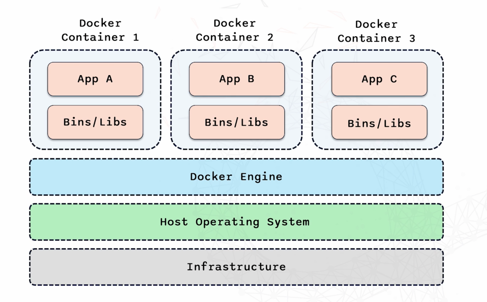

# Docker notes

**Challenge I complete - check out [here](https://github.com/Mohammed-islam0907/learning-devops/tree/main/Docker/coderco-challenge)
## What are containers?
- Containers are lightweight, portable units for running applications
- Contain code, runtime, and all dependencies the applications needsto run



- Infastructure represents the physical/virtual hardware where everything runs
- Above we have the Host operating system - runs directly on the infastructure e.g. Mac OS
- Docker engine - what makes containerisation possible - provides environment to build, run and manage containers
- Above we have docker containers - each container holds application and all the independencies the application needs to run
    - containers are isolated meaning they don't interfere with eachother 

## Benefits of Containers

- Isolation of containers means the applications don't interfere with eachother
- Provide consistent environment for applications to run - behave same wherever they run - e.g. Mac or Windows
- Containers share host operating system - therefore quick start up 

## What is Docker?

- Open platform for developing, shipping and running applications in containers
- Simplifies process of managing contaibers making it easer to build, deploy and manage applications

**Components of Docker**

1. Docker Engine- runs and manages containers based on instuction from docker files and images
2. Docker Hub - Repository where you can find and share Docker images

## Images & Containers

- Images - templates for creating containers 
    - They are immutable - don't change once created 
        - runs consistently no matter where it is deployed
- Containers - running instances of these images
    - What you intereact with 
    - Image = recipe, Container = product created
    - Container run application 

- Docker file is used to build Docker images 

## Importance of Docker today

- Docker simplified deployment
    - If application works in a Docker container on local macine, it works the same in production

- Improved efficiency
    - Virtual machines take long to load, Docker is lightweight because it shares the systems OS

- Enhanced collaboration
    - Can create Docker image and share it with the team
    - Onboarding new developers is easy

<br>

- **Integrates smoothly with CI/CD pipelines - allows for automated testing/building of containers**

## FAMOUS Interview Question: VMs vs. Containers

- VM's allows multiple operating systems to run on a single physical machine
- Base - infastructure and above we have host OS and abov we have the hypervisor - creates and manages virual machines by allocating resources e,g, CPU, memory, storage
- Each VM runs full guest OS, which is isolated from others e.g. I am using mac OS, but I can run Ubuntu - good if you need to run different operating systems(strong isolation)
- Each VM is resource heavy

<br>

- Containters - lightweight and efficient way to isolate applications
- Share host OS
- Instead of running hypervisor, they use Docker engine
- Share host OS
- Containers are isolated from eachother, but share same host OS (Process level isolation)
- startup faster


## Dockerfile

- ```FROM``` specifies base image for docker image
- ```RUN``` executes commands in the container
- ```COPY``` copies files from host machine int container 
- ```WORKDIR``` sets working directory 
- ```CMD``` specifies command to run when container starts 

## Docker Networking

**Basic Networking Concepts in Docker** 

 1. Bridge Network: Default network for containers on same machine - communicate using their own IP adresses - isolated from host machines network provides extra security
 
 2. Host Network: Container uses hosts network directly - useful for containers that need to interact closely with the host system  

 3. None Network: Gives container no network interface - completely isolated - used when you want to make sure container has no network, for secuirity reasons

 **Microservices allow different parts of an application to run as independant services - each in their own container**
  - Docker networking ensures these services can communicate efficiently 
  - Highly scalable, meaning you can scale as the application grows


## Recap on what is Docker?

Docker is a platform that allows developers to package applications into containers, which include all the necessary dependencies, making them portable and consistent across different environments.

## Key Concepts

- **Image**: A read-only template with the app and its environment.
- **Container**: A running instance of an image.
- **Dockerfile**: A script containing a series of instructions for building a Docker image.
- **Docker Hub**: A cloud-based registry where you can find and share Docker images.

---

## Common Docker Commands

### **Check Docker Version**
To check if Docker is installed and its version:
```bash
docker --version
```

### **List Docker images**

```bash
docker images
```

### **Pull image form Docker Hub**

```bash
docker pull <image_name>
```
e.g. 

```bash
docker pull mysql:5.7
```

### **Run container**

```bash 
docker run <image_name>
```

e.g running Nginx server

```bash
docker run -d -p 80:80 nginx
```

### **List Running Containers**

```bash
docker ps
```

### **Stop Running Container**

```bash
docker stop <container_id>
```

### **Remove Container**

```
docker rm <container_id>
```

### **Build an image**

```bash
docker build -t <image_name>
```

e.g.

```bash
docekr build -t my-flask-app
```

### **Create Network**

```bash
docker network create <network_name>
```

### **Run Container With Custom Network

```bash
docker run --network <network_name> <image_name>
```

### **Remove all  unused containers**

```bash
docker system prune
```

## Tips

- -d flag runs container in detachd mode (background)
- -p flag maps ports between the container and host machine e.g. (5002:5002)
- Name containers using --name option making it easier to manage
- -t allows you to specify a name (and optionally a tag)


## Docker Compose

- **Docker Compose helps run multiple Docker file containers together**

### **Key features**

1.  **Docker compose .yml file**
    - .yml file lists all services application needs e.g. which image to use/ which port to expose etc...

2. **Commands**

3. **Networking**
    - automatically creates network for you ensuring services can communicate


## Why Docker Compose is important

### 1. **Makes development and testing easier**

    - can quickly spin up exact environment needed with nessessary services e.g. webserver, database etc.. 
    - instead of manually setting each service, you compose everything into one Docker Compose yaml and run one command to start entire environment

### 2. **Ensures Consistency**

    - Ensures everyone in team is working in same environmet, reducing bugs and errors

### 3. **Enhances Teamwork**
    - Imagine new developer joins team
    - Instead of spending time setting up environment, they can clone the repository and they will have the same environment

---

## Docker Registries

- **Docker Registry is a system for storing and sharing Docker images**
- **Public Registry** - Place to share images to the world
- **Private Registries** e.g. AWS ECR - secure, restricted images 

## Importance of Docker Registries in DevOps

1. Streamline Deoplment process - once stored in registry, they can be easily accessed and deployed
2. Enhance collaboration - everyone has access to same resources 
3. Ensures Consitency - same image used in devolping, testing and production 


## Making Our Image Lighter: Multistage Builds

- Docker image I created is quite large - over 300mb
- Large images slow down deployment
    - consumes more badwith and requires more storage

- Multistage builds: allows you to use multiple FROM statements in Docker file
    -  One stage to build application and another, lighter stage to create final image that will be deployed
    - So there's a part that needs all the dependencies to build the application, but not all rhe dependencies are required in the final image
    - allows you to remove unessessary files

## Kubernetes (K8) 

- Kubernetes: Open source platform used for automating deployment/scaling application
- Powerful manager that oversees all containers
- Makes sure containers are deployed correctly, can scale up/don to meet demand, recover from failiure
- Allows you to focus more on application 
- Essential for DevOps engineers, enabling you to deploy, manage and scale applications with confidence

## Docker Swarm vs Kubernetes (Orchestration Tools)

 
| Docker Swarm| Kubernetes | 
|-----------|----------|
| No autoscaling| Autoscaling     | -    | 
|Good community | Great active community| 
| Easy to start a Cluster| Difficult to start cluster    | 
| Limited to Docker API's capabilities| Not limited to the Docker API's capabilities| 
| |    | 

 - Docker swarm is easier to use, and integrates seamlessly with Docker - good for smaller deployments
 - Kubernetes provides more powerf, flexibilty and scalability making it better for more complex deployments


## Why use Orchestration Tools?

- As application grows in complexity and scale, managing containers manually becomes more difficult
- Orchestration tools are used to handle many containers across multiple machines
- Ensure high availablitiy - automatically monitor state of containers and can restart/relocate containers allowing them to recover without manual intervention
- Automatically scale application - Up during high demand/ save resources during less demand 
- Self healing - detect and restart failed containers, ensuring  continuous service 

So they are used to:

- Simplify complex deployments
- Enhance reliability of application
- Improve resource utilisation


