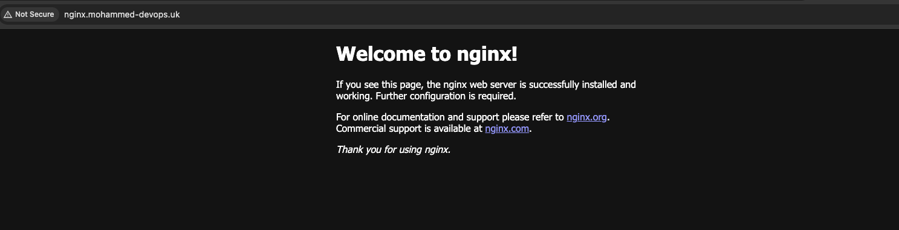

# NGINX Setup on AWS EC2 with Cloudflare Integration

## Project Overview
This project demonstrates the setup of an NGINX web server on an Amazon EC2 instance running Ubuntu. It includes the purchase of a domain through Cloudflare and configuring DNS settings to point to the EC2 instance. This practical application aligns with my DevOps learning path and enhances my understanding of cloud services and server management.

## Tools and Technologies Used
- **Amazon Web Services (AWS)**
  - EC2 Instance
- **Ubuntu** OS
- **NGINX** Web Server
- **Cloudflare** for DNS Management

## Step-by-Step Guide

### 1. Purchase Domain via Cloudflare
- Registered for Cloudflare and purchased the domain `mohammed-devops.uk`.

### 2. Setup AWS EC2 Instance
- Created an AWS account and launched an EC2 instance using Ubuntu Server.
- Configured security group to allow traffic on port 80.

### 3. Install and Configure NGINX
- Connected to the EC2 instance via SSH.
- Installed NGINX using Ubuntu's package manager:
  ```bash
  sudo apt update
  sudo apt install nginx

### 4. Configure DNS in Cloudflare
- Added an A record
- Name nginx
- Entered IPv4 of EC2 instance

### 5. Verify Setup
- Entered [http://nginx.mohammed-devops.uk/](http://nginx.mohammed-devops.uk/) into browser ad it worked!! 
- Might not work when you are viewing because I terminated my EC2 instance to avoid unwanted costs

