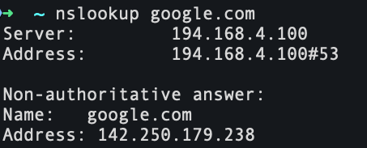
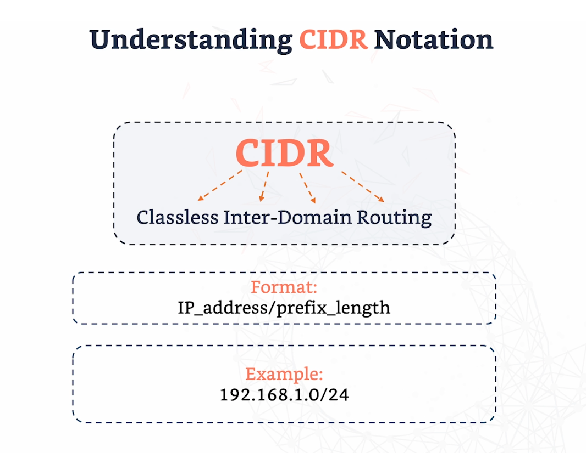

# Networking notes

## Overview of computer network
- **Network: A group of devices connected to allow data to be shared**

## LAN & WAN
- LAN - home wifi for e.g. 
- LAN used for connecting devices in single locations

- WAN - e.g. internet 
- connects multiple LAN's

## Switches, Routers and Firewalls

- Switches connect devices and manages data within same network 
- Routers connect devices in different networks
- Firewalls Acts like a security guard - monitors and controls incoming and outgoing traffic based on security rules and protects network from unauthorised access

## IP & MAC address
 ### IP addresses:

- 2 types: IPv4, IPv6

### IPv4: four decimal numbers seperated by dots - 32 bit address

### IPv6: eight groups of four hexadecimal digits (numbers 0-9 & letters A-f) - 128 but address

## MAC Addresses 

- 48 bit address 
- displayed in hexadecimal format 
- Operate at the data link layer 
- helps devices communicate with each other on a local network
- node - node transfer
- Essential in making sure your device connects to the right router 


## Ports & Protocols

- **Ports: Facilitates communication between devices**
- like logical doors for devices 
- When computer wants to send/receive data it uses these ports

- **Protocols: Ensure devices communicate effectively by following same set of rules**
- like languages devices use to communicate with eachother
- 

## **Ports:**

1. **TCP: Transmission Control Protocol**
    - Like postman of the internet
    - ensures that data sent from one devices reaches another device 
    - Before data is sent, **connection must be established**
    - Requires "Handshake" - ensures both devices are ready to send and receive data   
    - **Reliable** - ensures all data is received on the other end
    - ensures data is delivered in correct order
    - checks for errors in data 
    - Used whenever 2 devices need to exchange data back and forth e.g. emails

2. UDP: User Datagram Protocol
    - Simple protocol to senfd and receive 
    - Prior communicatio not needed
    - fast but less reliable
    - Used for real -time applications e.g. Facetime/Games
    - DNS
    - VPN

 


## Introduction to the **OSI Model**

### **7 Layers:**

7. Application - Network services are given directly to applications
6. Presentation - Data is translated to readable format 
5. Sessions 
4. Transport - End to end communication - TCP/UDP
3. Network - Routing and forwarding data packets manages
2. Data Link - Node to node transfer (switches/ethernet)
1. Physical - Physical structure - Fibre, wireless.. 


## 1. **Physical** 
- Deals with the physical components of network communication like cables, switches, and routers.
- Ethernet, USB, Bluetooth, Fibre optic cables

## 2. Data Link 
- Ensures reliable transmission of data across physical network
- Manages how devices on a network can access 
- Switches -Switching

## 3. Network Layer

- Handles movement of packets from sender to receiver
- IP addresses, Routers - routing

## 4. Transport

- Provides reliable data transfer services to the upper layers 
- Establishes rnd to end communication and data reliability
- TCP, UDP
## 5. Session Layer 

- Responsible for Establishing, Maintaining, Terminating session
- Session Managemnt Protocols - NFS, SQL

## 6. Presentation Layer

- Makes sure data is in useable format 
- Where encryption occurs
- SSL/TLS

## 7. Application Layer

- End user layer
- Provides network services to user
- Handles web browsing, file transfer, emails etc.
- HTTP(web), FTP(File transfer), SMTP(mails)

## TCP/IP model 


- A simplified version of OSI model - used in intenret  communication
- 4 layers:
TOP
    4. Application - Software applications interact with the network - HTTP (Web), FTP (File transfer), SMPT (Email)
    3. Transport - End to end transportation of data  - TCP/IP
    2. Internet - Responsible for ensuring data packets find their route from source to destination across different networks - IP
    1. Network Access - Encompasses physical and data link layer of the OSI model 
BOTTOM


## **DNS (Domain Name Server)**

**DNS: Translate Domain Name into IP address**

### DNS Components

**Name Servers (2 types)**
1. Authoritative:
    - Hold actual DNS record of domains and provides correct IP address when asked by recursive server
    - When recursive name server reaches an authoritative serverm it doesn't need to look any further because it has the official DNS records
    - Managed by DNS hosting provider e.g. GoDaddy
2. Recursive: 
    - Like the middle man - hunts for the **IP address**
    - Asks other DNS servers for information
    - Recursive name server provided by ISP or use public DNS service e.g. Google DNS
    - How it works:
    - Computer asks recursive name server for the IP address of www.wxample.com
    - Recursive server looks into its cahce to see if it already knows the IP address
    - If it does, it returns answer to computer or it looks into authorative name server for answer
    - Returns IP address to computer
    - Recursive server then caches IP address for future queries


**Zone Files**

- Stored in name servers - contain information about domain
- Help name server get to the domain if the name server doesn't know how to get to it directly 
- They organise DNS information in readable and manegable way 


## DNS Components: Records


**A & AAAA Records**
- A - Maps domain to IPv4 address
- AAAA - Maps domain to IPv6 address

**CNAME Records** 
- Alias of one name to another 
- e.g. www.google to come -> google.com

**MX Records**
- Mail Exchange record
- Defines mail server for a domain
- Ensures email delivery is reliable

**TXT Records**
- Purpose - verifies you own the domain
- Write text into domain

## How DNS works

- DNS Resolution - process of converting domain name into IP address


**DNS Hierarchy**


1. DNS Root - top of hierarchy - keeps high level information on where to find Top Level Domains (TLD's) beneath it
2. TLD - Department head - contain familiar extensions e.g. **.com, .org, .net** 
3. Authoritative Name Servers - contain detailed DNS records for domains e.g. google.com has its own domain record stored here
4. Domains - each domain has a zone and zone file which store DNS records for that domain (Authorative)

**DNS Resolution Process**


1. Type google.com
2. Browser sends query to a DNS resolver - DNS resolver looks for IP address - checks its local cache if it has IP address. If not it moves to next step
3. Resolver (Recursive name server) then queries root server for IP address. Root name server (top of DNS hierarchy) doesn't know the IP address but can direct the resolver to a specific resource - respond with address of TLD server; **.com**
4. Resolver queries TLD server - doesn't know IP address but can provide address of an **Authoritative name server**
5. Provides address of an **Authoritative name server**
6. Resolver queries Authoritative name server, whcih holds the actual DNS records for the domain, including IP address
7. IP address sent to DNS resolver
8. DNS resolver sends IP address to browser

## Importnce of DNS resolution for DevOPs Engineers

Debugging, troubleshooting, setting up networks and VPC's

## Domain Registrar vs DNS Hosting Provider

- Registrar: allows you to purchase and register domains e.g. GoDaddy
- DNS Hosting: Operates DNS Nameservers that host DNS zones e.g. AWS


## Network Debugging Tools: **nslookup** & **dig**

- ```nslookup (domain)``` allows you to find information about DNS records for domain
e.g.

```bash 
nslookup google.com
``` 

- **non-authoraitative** means response came from the cache and not from authoratative DNS server for google.com

- ```dig (domain)```
- more advanced 


## /etc/hosts File

- Local file on computer
- maps domain names to IP addresses
- when you type a domain into browser, it first checks this file, before quering DNS server 

**Editing /etc/hosts**
 
1. Open file with text editor ```sudo vim /etc/hosts```
2. Format: IP_address doamin_name


## Routing

Routing is the process of determining the best path for data to travel between networks
- Ensures data reaches destination efficiently

## Importance of routing
- Good routes reduces latency
- Ensures reliable application delivery
- Crucial for managing complex infastructures

## Static and dynamic routing

- Routes are manually set by Network admins 
- Dynamic - uses algorithms to automatically find the best route (Like navigation - Google Maps)

**Static Routing**
- manually configured
- fixed routes
- simple but not scalable - not good for larger networks but good for simple

**Dynamic Routing**
- Routes are adjusted automatically
- Uses routing protocols to find best path
- Scalabel and adaptable - responds to changes in network (like navigation responds to traffic and chooses different routes)

## Routing Protocols

- **Routing Protocols - Algorithms that determine best paths** 
- Automate route updates
- enhances efficieny - takes best route 
- 2 common protocols OSPF & BGP

**OSPF (Open Shortest Path First)**
- Finds shortest path for data to travel
- Used in large organisation 
- Quickly recalculates routes when there are changes in the network

**BGP (Border Gateway Protocol)**
- Used to route data between different autonomous systems 
- Autonomous systems - large networks managed by single organistaions
- Allows network admins to define routing policies - greater control 

## Subnetting
**Subnetting: Dividing a large network into smaller networks (subnets)**
- Improves network management
- CIDR notation:


## Binary

Base-2 number system - uses 0 & 1

**Binary -> Decimal conversion**


**IP -> Binary**


## Calculating Subnets

**Subnet Masks: Defines network and host parts**


## Example: subnet 192.168.1.0/26

**Finding Brodcast address**
- Network address: 192.168.1.0
- /26 CIDR notation means the first 26 bits are used for network and the remaining 6 is for the host 
- /26 shows the number of bits set to 1
- Therefore the subnet mask in binary is: 11111111.11111111.11111111.11000000 
- Inverting the mask gives ud the host bits: 00000000.00000000.00000000.00111111
- Convert to decimal: 0.0.0.63

- Add this to network address to find Broadcast address: 192.169.1.63

**Useable IP address**
- First useable IP addres: The network address + 1
    - 192.168.1.1
- Last useable IP address: Broadcast address - 1
    - 192.168.1.62
    - Therefore total number of useable IP addresses is 62 (from **192.168.1.1** to **192.168.1.62**)


## NAT (Network Address Translation)

- Converts private IP's into single, public IP 
- E.g. at home, your devices have their own private IP addresses, but when they go online, they all share 1 public IP address
- NAT handles this translation 
- Without this, each device would need its own public IP address which is not practical due to limited number of public IP addresses (IPv4 is running out)

**How NAT works**
1. Internal devices use private IP addresses
2. Router translates private IP address into public IP address
3. Faclitates communication with external networks

••Tpes of NAT**
- Static - maps single private IP to a single public IP address
- Dynamic - maps private IP to a public pool of IP addresses - once finished using this public IP address, it goes back into the pool for someone else to use
- PAT (Port Address Translation) - Allows multiple devices on local network to be mapped to a single public address but each has its own port number 

**NAT Example**

- Allows devices to communicate without exposing private IP address

**Benefits of NAT**

1. Conservation of public IP addresses
2. Enhances security (Hides private IP)

## Troubleshooting

- Ensures smooth operation
- Identify and fix issues
- Minimise downtime

**Examples**

- Connectivity loss
- Slow network performance
- IP address conflict (2 devices on same network have same IP address)
- DNS resolution failitures 

**Identifying symptoms**
- e.g. Device can't access internet:
    - check physical connection    
    - Test with ping command 
    - and more...

**Troubleshooting with ping command**
- ping - tests connectivity between devices
```ping google.com```
**Troubleshooting with traceroute command**
- tracks path your data takes to reach certain destination.
- e.g. ```traceroute google.com```

**Troubleshooting with nslookup command**
- To find IP address assosiated with domain name
- e.g. ```nslookup google.com```

## Practical example

**I can't access a website**

1. check network connectivity using ping command - return=network is good
2. nslookup - to check DNS is working

## Cloud Networking

- Practice of managing networks in cloud environments

**Components**
- VPC's (Virtual Private Cloud) - own private network in the cloud 
- Subnets - Subdivisions of VPC - different subnets for different resources
- Gateways - Connect VPC to internet  