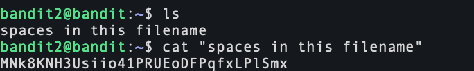

# Bandit Game 

## If you need assistance for the bandit game, here it is:

<br/>

### Level 0 (15/09/2024)


- ssh: This command initiates a secure shell connection, which allows me to securely access and manage a remote machine over an insecure network.

- bandit0: This is the username

- @bandit.labs.overthewire.org: This is the host name of the remote server

- -p 2220: Specifies the port number

<br>

### Level 0 → Level 1 (15/09/2024)


### Mistake I made: 
After logging in, I began by exploring the current directory with the ```ls``` command, which revealed a single file named "readme." Mistakenly, I first tried to access "readme" as if it were a directory using ```cd readme```, but quickly learned it was a file due to the error message returned.

### Here is a breakdown of what I did:
<br>

- ```ls``` : Lists all files and directories in the current directory. It's a fundamental command for navigating and understanding the structure of directories.

- ```cd readme```: Attempted to change to a directory named "readme," but failed because "readme" is a file. This error taught me to pay attention to the nature of directory listings.

- ```cat readme```: Displayed the contents of the "readme" file, which was crucial for obtaining the password to advance to the next level.

***Password***: ZjLjTmM6FvvyRnrb2rfNWOZOTa6ip5If

<br>

### Level 1 → Level 2 (15/09/2024)


### Mistake I made: 
 I mistakenly used ```cat -``` thinking it might help display file contents, but it was the wrong approach as it read from standard input instead. I then correctly used ```cat ./-``` to specify reading directly from a file named ```-```

Password: 263JGJPfgU6LtdEvgfWU1XP5yac29mFx

<br>

### Level 2 → Level 3 (15/09/2024)



- ```cat "spaces in this filename"```. Enclosing the filename in quotes is essential because it ensures the command treats the spaces as part of the filename

Password: MNk8KNH3Usiio41PRUEoDFPqfxLPlSmx


### Level 3 → Level 4 (15/09/2024)


