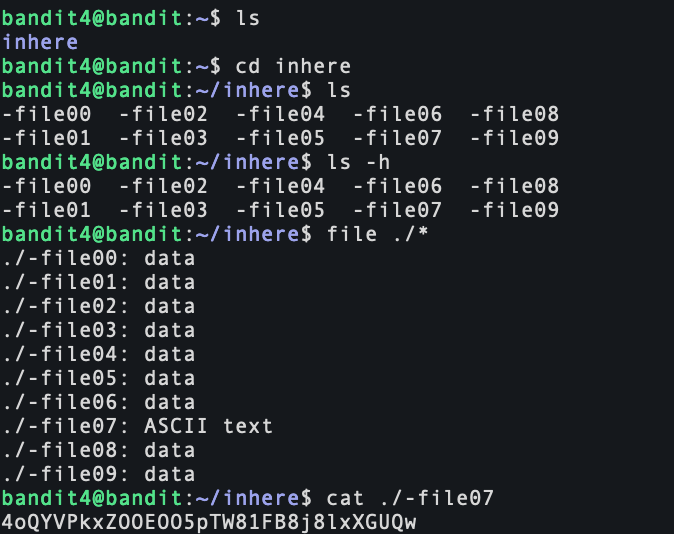
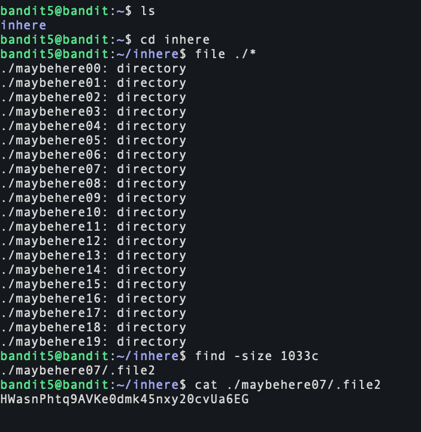
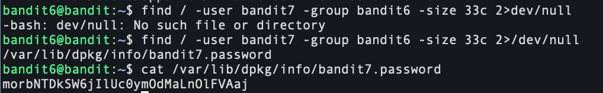
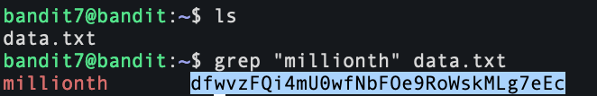
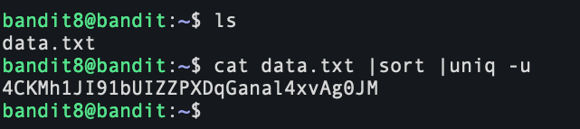
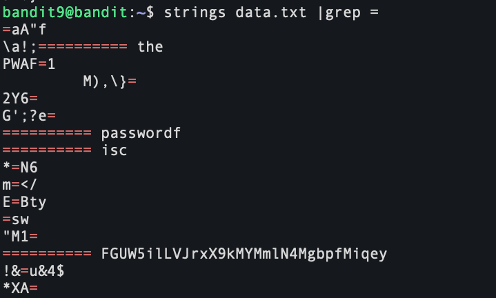
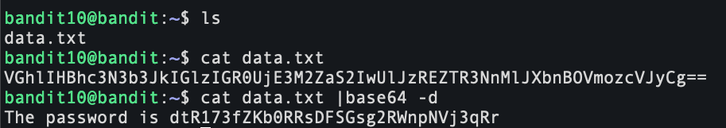
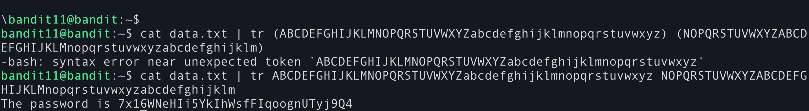
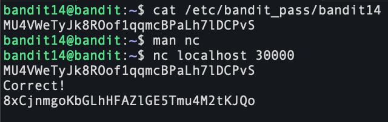

# Bandit Game 

## If you need assistance for the bandit game, here it is:

<br/>

### Level 0 (15/09/2024)


- ssh: This command initiates a secure shell connection, which allows me to securely access and manage a remote machine over an insecure network.

- bandit0: This is the username

- @bandit.labs.overthewire.org: This is the host name of the remote server

- -p 2220: Specifies the port number

<br>

### Level 0 → Level 1 (15/09/2024)


### Mistake I made: 
After logging in, I began by exploring the current directory with the ```ls``` command, which revealed a single file named "readme." Mistakenly, I first tried to access "readme" as if it were a directory using ```cd readme```, but quickly learned it was a file due to the error message returned.

### Here is a breakdown of what I did:
<br>

- ```ls``` : Lists all files and directories in the current directory. It's a fundamental command for navigating and understanding the structure of directories.

- ```cd readme```: Attempted to change to a directory named "readme," but failed because "readme" is a file. This error taught me to pay attention to the nature of directory listings.

- ```cat readme```: Displayed the contents of the "readme" file, which was crucial for obtaining the password to advance to the next level.

***Password***: ZjLjTmM6FvvyRnrb2rfNWOZOTa6ip5If

<br>

### Level 1 → Level 2 (15/09/2024)


### Mistake I made: 
 I mistakenly used ```cat -``` thinking it might help display file contents, but it was the wrong approach as it read from standard input instead. I then correctly used ```cat ./-``` to specify reading directly from a file named ```-```

Password: 263JGJPfgU6LtdEvgfWU1XP5yac29mFx

<br>

### Level 2 → Level 3 (15/09/2024)


- ```cat "spaces in this filename"```. Enclosing the filename in quotes is essential because it ensures the command treats the spaces as part of the filename

Password: MNk8KNH3Usiio41PRUEoDFPqfxLPlSmx


### Level 3 → Level 4 (15/09/2024)

- ```cd inhere```: navigate to the directory named "inhere"
- ```ls -la``` to list all contents of the directory, including hidden files
- ```cat ...Hiding-From-You```

**Password:** 2WmrDFRmJIq3IPxneAaMGhap0pFhF3NJ

### Level 4 → Level 5 (15/09/2024)



- ```cd``` inhere to navigate into the directory "inhere".
- ```ls``` to list the files in the directory, which revealed multiple files.
- ```file ./*``` to determine the types of all files in the directory. This command showed that most files were of type "data", except for one, "file07", which was of type "ASCII text".
- ```car ./file07``` displayed password

**Password:** 4oQYVPkxZOOEOO5pTW81FB8j8lxXGUQw

<br>

### Level 5 → Level 6 (15/09/2024)



- ```cd``` inhere to enter the specified directory.
ls to list all subdirectories under "inhere", which revealed multiple directories named "maybehereXX".

- ```file ./*``` to confirm that all listed items were directories.

- ```find . -size 1033c``` to locate files exactly 1033 bytes in size within these directories. This command returned "./maybehere07/.file2" as the match.

- ```cat ./maybehere07/.file2``` to display the contents of the identified file, which held the password for the next level.

**Password:** HWasnPhtq9AVKe0dmk45nxy20cvUa6EG

<br>

### Level 6 → Level 7 (15/09/2024)



### Level Goal
The password for the next level is stored somewhere on the server and has all of the following properties:
- Owned by user `bandit7`
- Owned by group `bandit6`
- 33 bytes in size

### Steps Taken
To achieve the goal, I followed these steps:

1. **Handle Permission Errors:** Due to numerous 'permission denied' errors, I redirected these errors to `/dev/null` using `2>/dev/null` to keep things clean.
   
2. **Find Command Execution:** Executed the command to search for the file:
   ```bash
   find / -user bandit7 -group bandit6 -size 33c 2>/dev/null

3. ```cat /var/lib/dpkg/info/bandit7.password``` 

## Bandit Level 7 → Level 8



### Level Goal
The password for the next level is stored in the file `data.txt` next to the word "millionth".

### Steps Taken
To retrieve the password, I followed these steps:

1. **List Files:** First, I listed the files in the directory to confirm the presence of `data.txt`:
   ```bash
   ls
2. ```grep "millionth" data.txt``` located the line containing the word "millionth", which had the password next to it 

<br>

## Bandit Level 8 → Level 9



### Level Goal
The password for the next level is stored in the file `data.txt` and is the only line of text that occurs only once.

### Steps Taken
1. **Check the File**:
   - Confirmed the presence of `data.txt` with the command:
     ```
     ls
     ```

2. **Retrieve the Unique Line**:
   - Executed the following command to identify the unique line:
     ```
     cat data.txt | sort | uniq -u
     ```
     - `cat data.txt` displays the contents of the file.
     - Piped (`|`) the output to `sort` to order the lines alphabetically, a necessary step as `uniq` requires sorted input to work correctly.
     - `uniq -u` filters out repeated lines, leaving only the unique line which contains the password.

### Conclusion
This method efficiently isolated the unique line in `data.txt`, using a streamlined combination of `cat`, `sort`, and `uniq -u`. This


<br>

## Bandit Level 9 → Level 10



### Level Goal
The password for the next level is stored in the file `data.txt` and appears within one of the few human-readable strings, preceded by several '=' characters.

### Steps Taken
1. **Examine the File**:
   - Used the following command to filter and display human-readable strings from `data.txt`, especially looking for strings preceded by '=':
     ```
     strings data.txt | grep '='
     ```

2. **Identify the Password**:
   - From the output, identified the line clearly marked by multiple '=' characters before the password, making it distinct among other strings.


<br>

## Bandit Level 10 → Level 11



### Level Goal
The password for the next level is stored in the file `data.txt`, which contains base64 encoded data.

### Steps Taken
1. **Check the File Content**:
   - Displayed the contents of `data.txt` to confirm the presence of base64 encoded data:
     ```
     cat data.txt
     ```

2. **Decode the Data**:
   - Used the `base64` command to decode the content and retrieve the password:
     ```
     cat data.txt | base64 -d
     ```

<br>

## Bandit Level 11 → Level 12



### Level Goal
The password for the next level is stored in the file `data.txt`, where all lowercase (a-z) and uppercase (A-Z) letters have been rotated by 13 positions, known as a ROT13 encryption.

### Steps Taken
1. **Examine the File**:
   - Displayed the contents of `data.txt`:
     ```bash
     cat data.txt
     ```

2. **Decrypt ROT13**:
   - Initially tried using the `tr` command incorrectly and received a syntax error:
     ```bash
     cat data.txt | tr (ABCDEFGHIJKLMNOPQRSTUVWXYZabcdefghijklmnopqrstuvwxyz) (NOPQRSTUVWXYZABCDEFGHIJKLMnopqrstuvwxyzabcdefghijklm)
     ```
   - Correctly used the `tr` command to perform a ROT13 decryption:
     ```bash
     cat data.txt | tr ABCDEFGHIJKLMNOPQRSTUVWXYZabcdefghijklmnopqrstuvwxyz NOPQRSTUVWXYZABCDEFGHIJKLMnopqrstuvwxyzabcdefghijklm
     ```
   - This command translates each letter to its counterpart 13 characters ahead or behind in the alphabet, effectively decrypting the ROT13 encoding.

<br>

## Bandit Level 12 → Level 13 (No image to due being very long)


### Level Goal
The password for the next level is stored in the file `data.txt`, which is a hexdump of a file that has been repeatedly compressed. To retrieve the password, a series of decompression steps must be performed.

### Steps Taken
1. **Create a Working Directory**:
   - Created a directory under `/tmp` to safely perform file operations:
     ```bash
     mkdir -p /tmp/idk
     ```

2. **Copy the Hexdump File**:
   - Copied the `data.txt` file into the new directory:
     ```bash
     cp data.txt /tmp/idk
     cd /tmp/idk
     ```

3. **Reverse the Hexdump**:
   - Used `xxd -r` to reverse the hexdump and saved the output into a new file:
     ```bash
     xxd -r data.txt > bandit
     ```

4. **Identify File Type**:
   - Determined the type of compression used on the reversed file:
     ```bash
     file bandit
     ```

5. **Decompress the File**:
   - Since the file was compressed with gzip:
     ```bash
     mv bandit bandit.gz
     gunzip bandit.gz
     ```

6. **Re-check File Type**:
   - Checked the new file type and continued decompression:
     ```bash
     file bandit
     mv bandit bandit.bz2
     bzip2 -d bandit.bz2
     file bandit
     mv bandit bandit.gz
     gunzip bandit.gz
     file bandit
     ```

7. **Handle TAR Archive**:
   - Decompressed the tar archive:
     ```bash
     mv bandit bandit.tar
     tar -xf bandit.tar
     file data5.bin
     mv data5.bin data5.tar
     tar -xf data5.tar
     file data6.bin
     mv data6.bin data6.bz2
     bzip2 -d data6.bz2
     file data6
     mv data6 data6.tar
     tar -xf data6.tar
     file data8.bin
     mv data8.bin data8.gz
     gunzip data8.gz
     file data8
     ```

8. **Retrieve Password**:
   - Once the file type was determined to be ASCII text, the final password was extracted:
     ```bash
     cat data8
     ```

## Bandit Level 13 → Level 14

### Level Goal
The password for the next level is stored in `/etc/bandit_pass/bandit14` and can only be read by user bandit14. Instead of a password, you are provided with a private SSH key that allows you to log into the bandit14 user account on the localhost.

### Steps Taken
1. **Identify the SSH Key**:
   - Upon logging in, identified a file named `sshkey.private` which is the SSH private key mentioned in the level description:
     ```bash
     ls
     ```

2. **Log in as bandit14**:
   - Used the SSH private key to log into the bandit14 account on the localhost:
     ```bash
     ssh -i sshkey.private bandit14@localhost
     ```
   - The `-i` option specifies that the subsequent file is used as the identity file (private key) for SSH login.

3. **Access the Password File**:
   - After logging into the bandit14 user account, navigated to the directory containing the password file:
     ```bash
     cd /etc/bandit_pass/
     ```
   - Read the password file for bandit14:
     ```bash
     cat bandit14
     ```

<br>

## Bandit Level 14 → Level 15



### Level Goal
The password for the next level can be retrieved by submitting the password of the current level to port 30000 on localhost.

### Steps Taken
1. **Retrieve the Current Level's Password**:
   - Accessed the password for the current level from the standard location:
     ```bash
     cat /etc/bandit_pass/bandit14
     ```

2. **Submit the Password via `nc` (Netcat)**:
   - Used `nc` to connect to localhost on port 30000 and submitted the password:
     ```bash
     nc localhost 30000
     ```
   - After the connection was established, pasted the password and received the next level's password.

<br>

## Bandit Level 15 → Level 16


### Level Goal
The password for the next level can be retrieved by submitting the password of the current level to port 30001 on localhost using SSL/TLS encryption.

### Steps Taken
1. **Establish a Secure Connection**:
   - Used `openssl s_client` to establish a secure SSL/TLS connection to the server on port 30001:
     ```bash
     openssl s_client -connect localhost:30001
     ```

2. **Submit the Current Level's Password**:
   - After successfully connecting, submitted the password of the current level through the secure channel. Noticed initial errors in command usage, which were corrected in subsequent attempts.
   - Ensured connection details were correct, checking for any issues with SSL certificates, notably the certificate was self-signed which is common in test environments.

3. **Receive the Next Level's Password**:
   - Once the correct password was submitted, the server responded with the next level's password:
     ```plaintext
     ksKvUpMQ7lBYyCM4GBpVCvT1BfWRy0Dx
     ```


## Bandit Level 16 → Level 17


### Level Goal
The credentials for the next level can be retrieved by submitting the password of the current level to a port on localhost in the range 31000 to 32000. The task involves identifying which port is listening and specifically which one supports SSL/TLS, as only one server will provide the correct credentials.

### Steps Taken
1. **Identify Listening Ports**:
   - Used `nmap` to scan the range of ports from 31000 to 32000 on localhost to identify which ports are open:
     ```bash
     nmap localhost -p 31046,31518,31691,31790,31960 -sV
     ```

2. **Test SSL/TLS Connection**:
   - Attempted to connect using SSL/TLS to various ports to identify the correct service. For instance, tried connecting to port 31790:
     ```bash
     openssl s_client -connect localhost:31790
     ```

3. **Submit Password via SSL/TLS**:
   - Once the correct SSL/TLS port was identified, submitted the current level's password using the `openssl s_client` command:
     ```bash
     echo "Current Level Password" | openssl s_client -quiet -connect localhost:31790
     ```
   - Received a response that included an RSA private key, indicating successful submission and receipt of the next level's credentials.

4. **Save and Use RSA Key**:
   - Saved the received RSA private key into a file for further use:
     ```bash
     nano /tmp/rsaprivate.key
     ```
   - Changed permissions for the private key file to ensure secure SSH login:
     ```bash
     chmod 600 /tmp/rsaprivate.key
     ```
   - Used the key to SSH into the next level:
     ```bash
     ssh -i /tmp/rsaprivate.key bandit17@localhost -p 2220
     ```


<br>

## Bandit Level 17 → Level 18


### Level Goal
The password for the next level is stored in `passwords.new` and is the only line that has been changed from `passwords.old`.

### Steps Taken
1. **List Available Files**:
   - Checked the contents of the home directory to locate the files:
     ```bash
     ls
     ```

2. **Compare the Two Files**:
   - Used the `diff` command to identify differences between `passwords.old` and `passwords.new`:
     ```bash
     diff passwords.old passwords.new
     ```
   - The `diff` command output showed which lines were different. The output format `> [line content]` indicated that these were lines from `passwords.new`.

3. **Extract the Password**:
   - The differing line from `passwords.new` provided the password for the next level